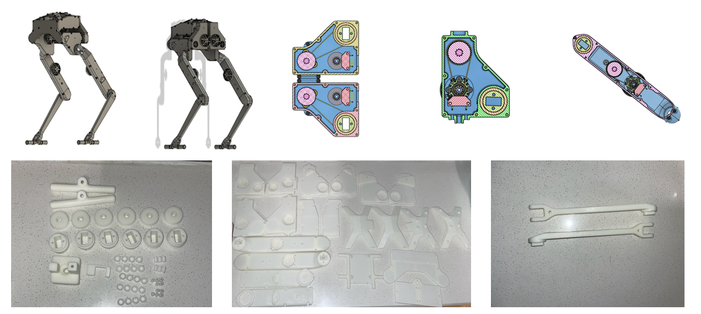
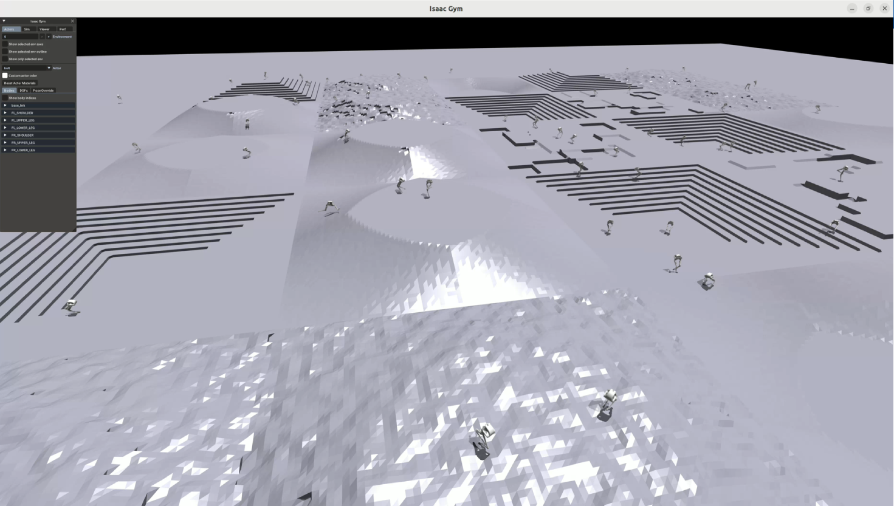
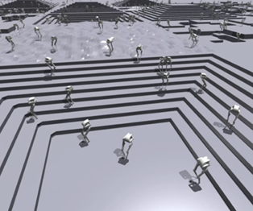
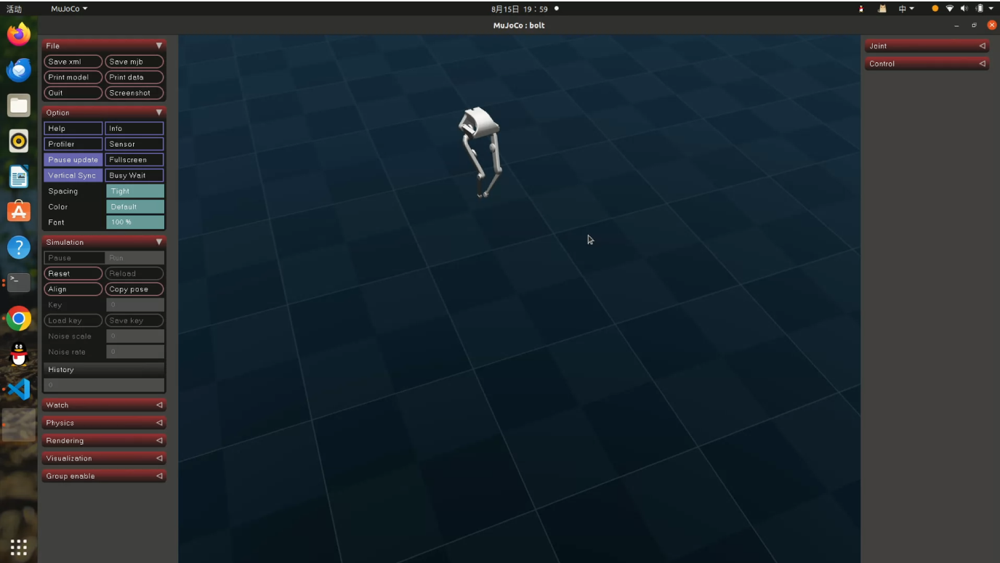
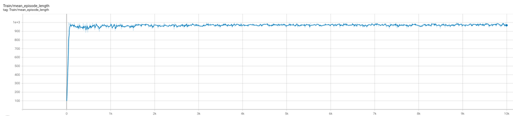

# Bipedal Projects

本仓库用于双足/腿足机器人相关的控制、训练、仿真与硬件联调，包含：

项目目标是制造并训练一款轻巧灵活的双足机器人，使其能够适应常见地形环境，并面向教学楼日常巡视等应用场景。

- 机器人执行器与底层通信相关代码（如 `Communication/`、`API_Control/`）
- 强化学习训练与策略验证相关代码（如 `legged_gym/`、`rsl_rl/`、`bolt_rl_training/`）
- 机器人模型、参数与仿真桥接代码（如 `bolt/`、`robot_properties_bolt/`、`projects-mujoco/`）

## 项目展示

> 图片资源位于仓库目录 `Pics/`。

## 开源项目来源说明

本项目包含基于开源项目进行的学习、适配与二次开发工作，核心参考来源：

- Open Dynamic Robot Initiative: `open_robot_actuator_hardware`
- 仓库地址：<https://github.com/open-dynamic-robot-initiative/open_robot_actuator_hardware>

请在使用和分发本仓库相关内容时，遵循原开源项目许可证要求。

## 使用说明（精简）

本文档基于 `创建环境关键提示.txt` 整理，重点提供项目级描述与最小上手方向，不展开命令级细节。

### 1) 环境准备

- 项目中存在Python 环境：`myenv`，请按训练/仿真任务选择对应环境。
- ROS/catkin 相关开发建议在独立工作空间中进行，并在 VS Code 中配置 `catkin_make` 构建任务。

### 2) 训练与评估

- 强化学习训练与策略评估主要在 `legged_gym/`、`rsl_rl/` 与 `bolt_rl_training/` 相关目录完成。
- 训练结果可通过 TensorBoard 等工具观察收敛趋势与奖励变化。

### 3) 模型与仿真对接

- 机器人模型通常需要在 `xacro/urdf/xml` 之间转换，并在不同仿真环境中补齐执行器和传感器配置。
- 从训练策略迁移到 MuJoCo 时，应重点核对自由度、增益、力矩限制和地形观测维度的一致性。

### 4) 常见排查方向

- 若仿真异常（如抖动、起飞），优先检查初始位姿、控制参数和观测输入是否与训练设置一致。
- 若运行失败，优先检查路径、依赖版本和环境激活状态是否正确。

## 注意事项

- 该仓库包含多个子项目，依赖与运行方式并不完全一致。
- 本 README 为总览说明，详细配置请参考各子目录中的 README 与源码。